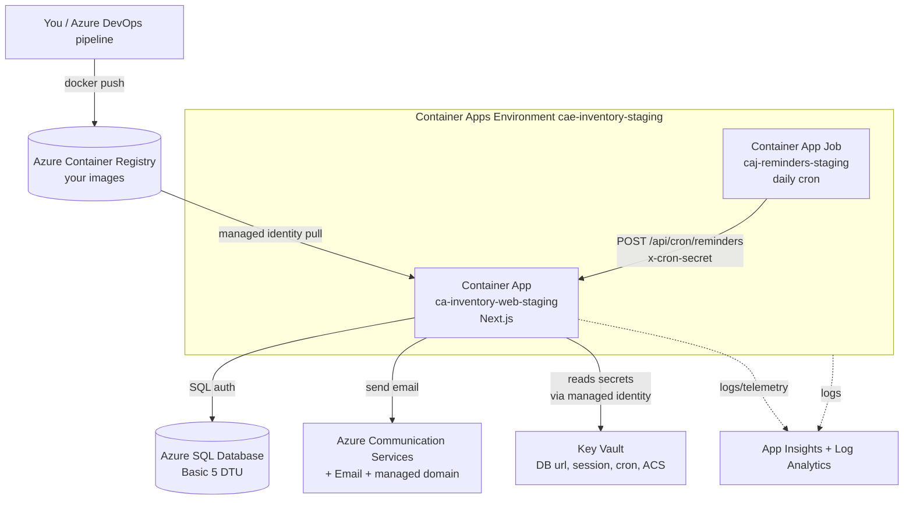

# Azure Staging Setup — `rg-staging`

A beginner-oriented, click-by-click guide to standing up the **production-shaped**
staging infrastructure for this app in the Azure **Portal**, with the concepts
explained as we go.

> You have **Contributor** access to the resource group **`rg-staging`**. That's
> enough to *create* every resource below. The one exception is reading/writing
> **Key Vault secrets**, which needs an extra role you'll grant yourself — see the
> gotcha in §4.

---

## 0. The big picture (read this first)

We're building this shape:



**What each piece is, in one line:**

| Resource | Role in this app |
|---|---|
| **Log Analytics workspace** | The database that stores all logs/metrics. Everything else points at it. |
| **Application Insights** | App-level monitoring (requests, errors, performance) on top of Log Analytics. |
| **Container Registry (ACR)** | Private store for your Docker images. Your pipeline pushes here; ACA pulls. |
| **Key Vault** | Encrypted store for secrets (DB password, session key, etc.). No secrets in plain config. |
| **Azure SQL Database** | Your Prisma database (SQL Server engine), Basic tier for staging. |
| **Communication Services (+Email)** | Sends notification emails (your `lib/email/acs` code). |
| **Container Apps Environment** | The secure boundary that hosts the web app + the cron job together. |
| **Container App** | Your running Next.js app (with ingress, scaling, revisions). |
| **Container App Job** | The daily reminder cron — pings the app's secure endpoint. |
| **Managed identity** | A passwordless Azure identity for the app, so it can pull images & read secrets without stored credentials. |

**Create them in this order** (each step depends on earlier ones):

1. Log Analytics workspace
2. Application Insights
3. Container Registry
4. Key Vault
5. Azure SQL Database
6. Communication Services + Email
7. Container Apps Environment + Container App (web)
8. Managed identity + secret wiring
9. Container App Job (cron)

---

## Conventions used below

- **"Create a resource"** = the big **+** at the top-left of the Portal, or just type the
  service name into the **top search bar** and pick it, then hit **Create**.
- Every create wizard starts with a **Basics** tab where you pick:
  **Subscription** (the client's), **Resource group = `rg-staging`**, and a **Region**.
- **Pick ONE region and use it for everything** (e.g. the region closest to your users).
  Keeping resources co-located avoids latency and cross-region data charges.
- Resource **names**: some must be *globally* unique (ACR, Key Vault, SQL server, ACS).
  I suggest names below; append a few random characters where "globally unique" is noted.
- After each create, click **Review + create → Create**, then **Go to resource**.

Suggested names (Azure's naming-convention style):

| Resource | Suggested name | Globally unique? |
|---|---|---|
| Log Analytics | `log-inventory-staging` | no |
| App Insights | `appi-inventory-staging` | no |
| Container Registry | `acrinventorystaging` (no dashes allowed) | **yes** |
| Key Vault | `kv-inv-stg-xxxx` | **yes** |
| SQL server (logical) | `sql-inventory-staging-xxxx` | **yes** |
| SQL database | `sqldb-inventory-staging` | no |
| Communication Services | `acs-inventory-staging` | **yes-ish** |
| Email Comm. Service | `acsemail-inventory-staging` | no |
| Container Apps Env | `cae-inventory-staging` | no |
| Container App (web) | `ca-inventory-web-staging` | no |
| Container App Job | `caj-reminders-staging` | no |

---

## 1. Log Analytics workspace

**Concept.** This is the central *log/metrics database*. Azure Monitor, Application
Insights, and Container Apps all *send* their data into a Log Analytics workspace,
and you *query* it with KQL (Kusto Query Language). You create it first because two
later resources (App Insights, the Container Apps Environment) need to point at it.

**Steps.**
1. Search **"Log Analytics workspaces"** → **Create**.
2. **Basics**: Resource group `rg-staging`; Name `log-inventory-staging`; Region.
3. **Review + create → Create**.

Nothing else to configure. Pricing is pay-per-GB-ingested; at staging volume this is
a few dollars/month or less.

---

## 2. Application Insights

**Concept.** Application Insights is *APM* (application performance monitoring): it
records incoming requests, failures, dependencies (like your SQL calls), and live
metrics. "Workspace-based" means it stores that data **in the Log Analytics workspace**
from §1 (the modern, recommended mode). Wiring the SDK into the app is optional and
can come later — creating the resource now gives you the connection string to use when
you're ready.

**Steps.**
1. Search **"Application Insights"** → **Create**.
2. **Basics**: RG `rg-staging`; Name `appi-inventory-staging`; Region;
   **Resource Mode = Workspace-based**; **Log Analytics Workspace =** `log-inventory-staging`.
3. **Review + create → Create → Go to resource**.
4. On the **Overview**, copy the **Connection String** and keep it for later
   (env var `APPLICATIONINSIGHTS_CONNECTION_STRING` if/when you add the SDK).

---

## 3. Azure Container Registry (ACR)

**Concept.** A private Docker registry — the "Docker Hub" for your images, but locked
to the client's Azure. Your Azure DevOps pipeline will build the image and
`docker push` it here (e.g. `acrinventorystaging.azurecr.io/inventory-web:latest`); the
Container App will **pull** from here to run. We keep the **admin user disabled** and
instead let the app authenticate with its **managed identity** (§8) — more secure than a
shared username/password.

**Steps.**
1. Search **"Container registries"** → **Create**.
2. **Basics**: RG `rg-staging`; **Registry name** `acrinventorystaging`
   (globally unique, letters/numbers only — **no dashes**); Region; **SKU = Basic**.
3. **Review + create → Create → Go to resource**.
4. On **Overview**, note the **Login server**: `acrinventorystaging.azurecr.io`.
   You'll use this in the pipeline and when pointing the app at its image.

> The registry is empty for now — that's fine. In §7 we start the app on a temporary
> public "hello world" image, then switch it to your ACR image once the pipeline pushes one.

---

## 4. Key Vault

**Concept.** A managed, encrypted secret store. Instead of pasting your DB password or
ACS key into plaintext config, you store them here and let the app read them at runtime
via its managed identity. Two access "planes" matter:
- **Management plane** (create/configure the vault) — your **Contributor** role covers this.
- **Data plane** (read/write the actual secret values) — under RBAC mode this needs a
  **separate role**. **This is the #1 beginner gotcha**, handled in step 5 below.

**Steps.**
1. Search **"Key vaults"** → **Create**.
2. **Basics**: RG `rg-staging`; Name `kv-inv-stg-xxxx` (globally unique, 3–24 chars); Region.
3. **Access configuration** tab: **Permission model = Azure role-based access control (RBAC)**
   (recommended and modern — avoids the older "access policies").
4. **Review + create → Create → Go to resource**.
5. **⚠️ Grant yourself data-plane access** (needed to add secrets):
   - Vault → **Access control (IAM)** → **Add → Add role assignment**.
   - Role: **Key Vault Secrets Officer** → **Next**.
   - Members: **User, group, or service principal** → select **your own account** → **Review + assign**.
   - Wait ~1 minute for it to propagate.

We'll **add the actual secrets in §8**, once the DB and ACS exist and we know their values.

---

## 5. Azure SQL Database (Basic)

**Which tile?** Use **"SQL databases"** (a single, fully-managed database — PaaS).
*Not* "Azure SQL" (that's just a chooser page), *not* "Managed Instance" (a whole
SQL Server, expensive), *not* "reserved vCores" (a billing reservation).

**Concept.** A single Azure SQL database runs on a **logical server**
(`*.database.windows.net`) that you also create here. The server holds the admin login
and the **firewall**; the database holds your tables. Prisma's `sqlserver` provider talks
to it over an encrypted connection string. **Basic tier** = 5 DTU / 2 GB — perfect for
staging (prod moves to S1+ as we discussed).

**Steps.**
1. Search **"SQL databases"** → **Create**.
2. **Basics**:
   - RG `rg-staging`; **Database name** `sqldb-inventory-staging`.
   - **Server** → **Create new**:
     - Server name `sql-inventory-staging-xxxx` (globally unique); Location = your region.
     - **Authentication method** → **Use SQL authentication** (this is what Prisma uses).
     - **Server admin login** e.g. `sqladmin`; set a **strong password** — save both now.
     - **OK**.
   - **Want to use SQL elastic pool?** → **No**.
   - **Workload environment** → **Development** (just sets friendlier defaults).
   - **Compute + storage** → **Configure database**:
     - Change **Service tier** to **Basic (DTU-based)** → this pins 5 DTU / 2 GB → **Apply**.
   - **Backup storage redundancy** → **Locally-redundant** (cheapest; fine for staging).
3. **Networking** tab:
   - **Connectivity method = Public endpoint**.
   - **Allow Azure services and resources to access this server = Yes**
     *(lets the Container App connect — ACA's outbound IPs aren't static, so IP rules alone won't work for staging).*
   - **Add current client IP = Yes** *(so you can connect from your machine to run migrations).*
4. **Review + create → Create → Go to resource**.
5. Note the server FQDN from **Overview**: `sql-inventory-staging-xxxx.database.windows.net`.

**Your Prisma `DATABASE_URL`** (SQL Server format — note the `;`-separated params):

```
sqlserver://sql-inventory-staging-xxxx.database.windows.net:1433;database=sqldb-inventory-staging;user=sqladmin;password=YOUR_PASSWORD;encrypt=true
```

- `encrypt=true` is **required** by Azure SQL.
- **Pooling:** Basic allows only ~30 concurrent workers. Keep Prisma's pool small
  (aim for `replicas × pool ≤ ~20`). Prisma sets pool size on the connection URL — confirm
  the exact parameter for the **SQL Server** connector in Prisma's connection-URL docs, since
  SQL Server uses ADO.NET-style `;` params rather than the usual `?connection_limit=`.
- **Run migrations** once the DB exists (your machine's IP is now allow-listed):
  set `DATABASE_URL` locally and run `npm run db:migrate:deploy`. (Later this becomes a
  pipeline step.)

> **Hardening note (later):** for prod, create a dedicated least-privilege SQL user for the
> app instead of using the server admin, and move to a private endpoint + VNet-integrated ACA.

---

## 6. Azure Communication Services + Email

This is the most multi-part resource: a **Communication Services** parent, an **Email
Communication Service**, a **domain**, and then **connecting** the two. Your app code in
[`lib/email/acs/sender.ts`](../lib/email/acs/sender.ts) already knows how to use it — it
just needs the connection string, a sender address, and `EMAIL_PROVIDER=acs`.

**Concept.** Communication Services (ACS) is a multi-channel comms platform (email, SMS,
chat). For email you must: (a) have an ACS resource, (b) have an Email service with a
**verified sender domain**, and (c) **connect** that domain to the ACS resource so it can
send. For staging we use a free **Azure-managed domain** (instant, no DNS work); it sends
from `DoNotReply@<random>.azurecomm.net` and has modest rate limits — fine for staging.

**Steps.**

**6a. Create the Communication Services resource**
1. Search **"Communication Services"** → **Create**.
2. **Basics**: RG `rg-staging`; **Resource name** `acs-inventory-staging`;
   **Data location** — pick per the client's data-residency needs. **⚠️ This is permanent.**
3. **Review + create → Create**.

**6b. Create the Email Communication Service**
1. Search **"Email Communication Services"** → **Create**.
2. **Basics**: RG `rg-staging`; Name `acsemail-inventory-staging`; **Data location** (match 6a).
3. **Review + create → Create → Go to resource**.

**6c. Provision a managed domain**
1. In the **Email Communication Service** → left menu **Provision domains** (or **Domains**).
2. **Add domain → Azure managed domain → Add**. After a moment you get a domain like
   `xxxxxxxx.azurecomm.net` with a ready sender address.

**6d. Connect the domain to the ACS resource**
1. Go to the **Communication Services** resource (`acs-inventory-staging`) → **Email → Domains**.
2. **Connect domain** → pick the subscription/RG → select your Email service +
   the managed domain → **Connect**.

**6e. Collect the two values your app needs**
1. **Sender address** (`ACS_SENDER_ADDRESS`): in the managed domain → **MailFrom addresses** →
   copy the default, e.g. `DoNotReply@xxxxxxxx.azurecomm.net`.
2. **Connection string** (`ACS_CONNECTION_STRING`): Communication Services resource → **Keys** →
   copy the **primary connection string** (looks like `endpoint=https://...;accesskey=...`).
   → we'll put this in **Key Vault** in §8.

**6f. Activate in the app**
- `npm i @azure/communication-email` (your code lazy-imports it, so it's only needed when
  `EMAIL_PROVIDER=acs`).
- Env vars: `EMAIL_PROVIDER=acs`, `ACS_CONNECTION_STRING`, `ACS_SENDER_ADDRESS` (set in §8).

---

## 7. Container Apps Environment + Container App (web)

**Concept — Environment.** A **Container Apps Environment** is the secure boundary (its
own virtual network + a Log Analytics hookup) in which one or more container apps and jobs
run. Apps in the same environment can talk to each other and share the same logs
destination. You create it once; both the web app (§7) and the cron job (§9) live in it.

**Concept — Container App.** Your actual running service. Key sub-concepts:
- **Ingress** — the public HTTPS front door; you set the **target port** to whatever your
  container listens on.
- **Revisions** — every config/image change creates a new immutable revision; you can split
  traffic between them (this is your built-in blue/green, replacing App Service "slots").
- **Scaling** — **min/max replicas** plus **scale rules** (e.g. HTTP concurrency).

**Steps.**
1. Search **"Container Apps"** → **Create**.
2. **Basics**:
   - RG `rg-staging`; **Container app name** `ca-inventory-web-staging`; Region.
   - **Container Apps Environment → Create new**:
     - Name `cae-inventory-staging`.
     - **Monitoring** tab (inside the env dialog) → **Log Analytics =** `log-inventory-staging`.
     - **Create**.
3. **Container** tab:
   - ✅ **Use quickstart image** — this starts the app on a public placeholder
     (`mcr.microsoft.com/k8se/quickstart`) so you can finish wiring before your real image
     exists. We swap it for your ACR image after the pipeline's first push.
4. **Ingress** tab:
   - **Ingress = Enabled**; **Ingress traffic = Accepting traffic from anywhere** (external).
   - **Target port = 80** *(the quickstart image listens on 80). **Remember:** when you switch
     to your Next.js image, change this to **3000** — Next.js standalone listens on `PORT`,
     default 3000.)*
5. **Review + create → Create → Go to resource**.
6. On **Overview**, copy the **Application Url**:
   `https://ca-inventory-web-staging.<region>.azurecontainerapps.io`. Save it — the cron
   job (§9) and, if you use Entra SSO, the redirect URI need it.
7. **Set scaling** (app → **Application → Scale (and replicas)** or **Scale**):
   - **Min replicas = 1** (avoids a cold start on the first morning request).
   - **Max replicas = 3** (headroom for the morning submission burst).
   - **Add scale rule → HTTP → Concurrent requests = 50**.

> **Switching to your real image later:** app → **Containers → Edit and deploy** → select the
> container → **Image source = Azure Container Registry** → pick `acrinventorystaging`, your
> image + tag → **Authentication = Managed identity** (set up in §8) → also set **Target port
> = 3000** under Ingress. **Save** creates a new revision.

---

## 8. Managed identity + secret wiring (the heart of "production-shaped")

**Concept — Managed identity.** Rather than storing an ACR password or a Key Vault key
*inside* the app, Azure gives the Container App its **own identity** in Entra ID
(a "system-assigned managed identity"). You then grant that identity **roles** on other
resources (pull from ACR, read Key Vault secrets). The platform handles the credentials
invisibly — nothing secret lives in your config. This is the passwordless, best-practice way.

**8a. Turn on the app's managed identity**
1. App → **Settings → Identity → System assigned** → **Status = On → Save → Yes**.
2. Note the **Object (principal) ID** that appears.

**8b. Let it pull images from ACR**
1. Go to **ACR** (`acrinventorystaging`) → **Access control (IAM) → Add role assignment**.
2. Role **AcrPull** → **Next** → Members: **Managed identity** → select
   `ca-inventory-web-staging` → **Review + assign**.

**8c. Let it read Key Vault secrets**
1. Go to **Key Vault** → **Access control (IAM) → Add role assignment**.
2. Role **Key Vault Secrets User** → Members: **Managed identity** →
   `ca-inventory-web-staging` → **Review + assign**.

**8d. Put the secrets into Key Vault**
(You granted yourself **Secrets Officer** back in §4-5, so you can add these now.)
Vault → **Objects → Secrets → + Generate/Import**, create each:

| Secret name | Value |
|---|---|
| `database-url` | the full Prisma `DATABASE_URL` from §5 |
| `session-secret` | a long random string — generate with `openssl rand -base64 32` (or PowerShell: `[Convert]::ToBase64String((1..32|%{Get-Random -Max 256}))`) |
| `acs-connection-string` | the ACS connection string from §6e |
| `cron-secret` | another long random string (the Job in §9 reuses this) |
| `azure-ad-client-secret` | Entra app client secret (§10a) — add when you enable internal SSO |
| `magic-link-secret` | a long random string, **distinct from `session-secret`** — signs external magic-links (§10c) |

**8e. Reference those secrets from the Container App**
1. App → **Settings → Secrets → Add**.
2. For each: **Type = Key Vault reference** → pick the vault + secret (latest
   version) → **Identity = System assigned** → **Add**. This creates app-level secrets named
   e.g. `database-url` that always fetch from Key Vault.

**8f. Map env vars to those secrets (and set the plain ones)**
App → **Containers → Edit and deploy** → select the container → **Environment variables** →
add:

| Env var | Source |
|---|---|
| `DATABASE_URL` | **Reference a secret** → `database-url` |
| `SESSION_SECRET` | **Reference a secret** → `session-secret` |
| `ACS_CONNECTION_STRING` | **Reference a secret** → `acs-connection-string` |
| `CRON_SECRET` | **Reference a secret** → `cron-secret` |
| `MAGIC_LINK_SECRET` | **Reference a secret** → `magic-link-secret` *(external magic-link, §10c)* |
| `APP_URL` | **Manual entry** → `https://ca-inventory-web-staging.<region>.azurecontainerapps.io` *(§10c)* |
| `ACS_SENDER_ADDRESS` | **Manual entry** → `DoNotReply@xxxxxxxx.azurecomm.net` |
| `EMAIL_PROVIDER` | **Manual entry** → `acs` |
| `NODE_ENV` | **Manual entry** → `production` |
| `APPLICATIONINSIGHTS_CONNECTION_STRING` | **Manual entry** → from §2 (optional, if you add the SDK) |

*(Optional — only if you enable Microsoft Entra SSO, per `integration/entra`:*
`AZURE_AD_CLIENT_ID`, `AZURE_AD_TENANT_ID`, `AZURE_AD_CLIENT_SECRET` *(as a Key Vault secret),*
`AZURE_AD_REDIRECT_URI` *= `https://<app-url>/…` — set these once you register the Entra app.)*

Click **Save** — this deploys a **new revision** with all the config.

---

## 9. Container App Job (daily reminder cron)

**Concept.** A **Container App Job** is a *run-to-completion* workload (not an always-on
service) that the environment starts on a **schedule**, and you're billed only for the
seconds it runs. Because your reminder logic is already exposed as a secure HTTP endpoint,
the job doesn't need your app's image or the database — it just makes one authenticated
`curl` to `POST /api/cron/reminders`, exactly like your reference Azure Function. (Once this
works you can retire `integration/azure-functions`.)

**Steps.**
1. Search **"Container App Jobs"** → **Create** (or Container Apps → **Jobs → Create**).
2. **Basics**:
   - RG `rg-staging`; **Job name** `caj-reminders-staging`; Region;
   - **Container Apps Environment =** `cae-inventory-staging` (the same one).
   - **Trigger type = Schedule**; **Cron expression = `0 8 * * *`** (daily 08:00 UTC — matches
     your existing Function). Parallelism 1, replica completion count 1.
3. **Container** tab:
   - **Image source = Docker Hub or other registries**; **Image =** `curlimages/curl:latest`
     (a tiny public image with `curl`).
   - **Command override** — set:
     - Command: `/bin/sh`
     - Args: `-c, curl -sS -X POST -H "x-cron-secret: $CRON_SECRET" https://ca-inventory-web-staging.<region>.azurecontainerapps.io/api/cron/reminders`
       *(use your real Application Url from §7-6)*.
4. **Review + create → Create → Go to resource**.
5. **Give the job the `CRON_SECRET`** (same value as the app):
   - Job → **Settings → Identity → System assigned → On → Save**.
   - Key Vault → **IAM** → assign **Key Vault Secrets User** to the **job's** identity (as in §8c).
   - Job → **Settings → Secrets** → add `cron-secret` as a **Key Vault reference**.
   - Job → **Containers/Environment variables** → `CRON_SECRET` → **Reference a secret** → `cron-secret`.
6. **Test it now**: Job → **Run now** → check **Execution history** → the run should exit 0,
   and your app's Outbox / `NotificationLog` should reflect the reminder check.

> **Why not run `npm run reminders` in the job?** You could, but your production Docker image
> uses Next.js *standalone* output, which won't include `tsx`/`scripts`. The `curl`-the-endpoint
> approach avoids that entirely and matches how your Azure Function already works.

**Or create it via CLI** (reproducible equivalent; wire identity + secret as in step 5):
```bash
az containerapp job create \
  --name caj-reminders-staging \
  --resource-group rg-staging \
  --environment cae-inventory-staging \
  --trigger-type Schedule \
  --cron-expression "0 8 * * *" \
  --replica-timeout 300 --replica-retry-limit 1 \
  --image curlimages/curl:latest --cpu 0.25 --memory 0.5Gi \
  --command "/bin/sh" \
  --args "-c" "curl -sS -X POST -H \"x-cron-secret: \$CRON_SECRET\" https://<app-url>/api/cron/reminders"

# then enable identity, grant it Key Vault Secrets User, and add the secret + env var:
az containerapp job identity assign --name caj-reminders-staging -g rg-staging --system-assigned
az containerapp job secret set --name caj-reminders-staging -g rg-staging \
  --secrets cron-secret=keyvaultref:https://kv-inv-stg-xxxx.vault.azure.net/secrets/cron-secret,identityref:system
```

---

## 10. Identity & access — how users sign in

Two populations sign in two different ways. The app's session layer
([`lib/auth/session.ts`](../lib/auth/session.ts)) is **auth-provider-agnostic** — every
path just ends by calling `createSession(user.id)` — so the two methods coexist, and
**authorization is always driven by the `User` row's role + grower/vendor mapping, not by
*how* the user logged in**.

| Population | Roles | How they sign in |
|---|---|---|
| Internal client staff | `SuperAdmin`, `InternalAdmin`, `Editor` | **Microsoft login (Entra ID)** |
| Growers & vendors | `GrowerUser`, `VendorUser` | **App-managed email** (passwordless link) |

### 10a. Internal users — Microsoft login (Entra ID)

**Concept.** The app is an OIDC *relying party* against the **client's own Entra tenant**.
On callback it matches the Entra **object id (`oid`)** — falling back to the admin-provisioned
email the first time — to a `User` row (reference code in
[`integration/entra/auth-routes.ts`](../integration/entra/auth-routes.ts)), **backfills
`User.entraObjectId`** so a later email change can't lock the person out, and if active issues
the normal session. "Reject if unprovisioned" is the built-in access gate.

> **⚠️ This is NOT done from `rg-staging`.** An **app registration** lives in the client's
> **Entra directory**, which your resource-group **Contributor** role does *not* let you
> touch. The client's IT must create it, or grant you **Application Administrator**. Plan
> for this hand-off — it's the most common surprise.

Steps (in the **client's Entra tenant**, by you or their admin):
1. **Entra ID → App registrations → New registration.**
   - **Supported account types = Accounts in this organizational directory only**
     (**single-tenant**) — this alone blocks any non-client account.
   - **Redirect URI (Web)** = `https://ca-inventory-web-staging.<region>.azurecontainerapps.io/api/auth/callback`.
2. Note the **Application (client) ID** and **Directory (tenant) ID**.
3. **Certificates & secrets → New client secret** → copy the value **once** → store in
   **Key Vault** as `azure-ad-client-secret` (§8 pattern), never in plain config.
   *(Secrets expire in 6–24 months — set a rotation reminder, or later switch to a
   federated credential to drop the secret entirely.)*
4. **API permissions → Microsoft Graph → `User.Read`** (delegated) → **Grant admin consent**.
5. **Limit who can sign in** (defence-in-depth on top of the app's provisioning gate):
   - **Enterprise applications → <your app> → Properties → Assignment required = Yes.**
   - **Users and groups → Add →** assign a security group (e.g. `InventoryApp-Users`);
     unassigned staff are stopped at Microsoft's login. *(Assigning a **group** needs
     **Entra ID P1**; individual-user assignment is free.)*

**App wire-up:** `npm i @azure/msal-node`; create the 3 route handlers from the reference
file; set env vars `AZURE_AD_TENANT_ID`, `AZURE_AD_CLIENT_ID`,
`AZURE_AD_CLIENT_SECRET` (Key Vault reference), `AZURE_AD_REDIRECT_URI`.

**Three layers of access control**, weakest to strongest:
1. **Single-tenant registration** → only client-directory accounts can attempt sign-in.
2. **App provisioning gate (already built)** → session only issued if an active `User` row
   matches the email. Admins in the users page are the source of truth. Works on any Entra tier.
3. **Assignment required + group** (optional, needs P1) → unassigned staff blocked at Entra.

### 10b. External users — app-managed email (recommended: passwordless)

**Do NOT make growers/vendors Entra B2B guests** — that puts 50–100 external accounts in
the client's *corporate* directory (governance/pollution) and needs Graph provisioning, for
no authorization benefit (the app already gates via the `User` table).

Two viable routes:

- **Recommended — passwordless magic-link, app-managed.** Reuses what you already have
  (`jose` signed tokens + ACS delivery). Two endpoints: *request a link* (email a
  short-lived signed token) and *consume it* (verify → `createSession`). No passwords ⇒ no
  forgot/reset/lockout/policy to build. `passwordHash` can stay `null`. This is **app
  development work, not Azure infra.**
- **Alternative — Entra External ID (managed CIAM).** If you'd rather own *zero* auth flows:
  Microsoft hosts sign-up/in, reset, MFA; your app does one OIDC callback (like 10a).
  External users live in a **separate external tenant** — *not* the corporate directory — so
  none of the guest governance problems. Free at this scale (~first 50k monthly active
  users). Cost: another Azure product + tenant to configure, and a second IdP to run.

> The `AUTH_PROVIDER=entra` switch in `INTEGRATION.md` assumed "Entra for everyone." For this
> **hybrid** you don't flip one provider — you keep **both** login routes live, and `/login`
> offers "Sign in with Microsoft" *and* the email option. They partition naturally: vendors
> have no client-tenant account; internal users have no `passwordHash`.

**Identity checklist**
- [ ] App registration in the **client's** Entra tenant (single-tenant); redirect URI set
- [ ] Client secret stored in Key Vault as `azure-ad-client-secret`
- [ ] `User.Read` admin-consented
- [ ] (optional) Assignment required + `InventoryApp-Users` group (needs P1)
- [ ] `@azure/msal-node` installed; 3 auth routes wired; `AZURE_AD_*` env vars set
- [ ] External-user flow chosen (magic-link vs External ID) and built
- [ ] (magic-link) `magic-link-secret` in Key Vault; `MAGIC_LINK_SECRET` + `APP_URL` env vars set

### 10c. Magic-link setup (external users) — infra side

The app-dev work (routes, `MagicToken` model, sliding session) lives in
[`integration/magic-link/`](../integration/magic-link) with activation steps in
`integration/INTEGRATION.md` §4. On **their infra** you only add one secret and two env vars
(ACS is already set up in §6):

1. **Key Vault** → add secret `magic-link-secret` = a long random string **distinct from
   `session-secret`** (§8d).
2. **Container App → Secrets** → add a Key Vault reference to it (§8e), then set **env vars** (§8f):
   - `MAGIC_LINK_SECRET` → reference `magic-link-secret`
   - `APP_URL` → `https://ca-inventory-web-staging.<region>.azurecontainerapps.io` (used to build the link)
3. Confirm `EMAIL_PROVIDER=acs`, `ACS_CONNECTION_STRING`, `ACS_SENDER_ADDRESS` are set (§6/§8) —
   the magic-link email uses the same ACS sender.
4. The `MagicToken` table ships as a Prisma migration (added on activation) and is applied by the
   pipeline's `prisma migrate deploy` step (§13) — no manual DB work.

Links expire in **15 min** and are single-use; the **7-day session** they create rolls forward on
activity if you enable the sliding-session middleware (both app-side, per INTEGRATION.md §4).

---

## 11. Final checklist

- [ ] Log Analytics workspace created
- [ ] App Insights (workspace-based) created; connection string saved
- [ ] ACR created; login server noted; admin user left **disabled**
- [ ] Key Vault created (**RBAC** mode); you have **Secrets Officer** on it
- [ ] SQL DB (Basic) created; firewall allows **Azure services** + **your IP**; `DATABASE_URL` built
- [ ] `prisma migrate deploy` run against the new DB
- [ ] ACS + Email + managed domain created **and connected**; sender + connection string saved
- [ ] `@azure/communication-email` installed; `EMAIL_PROVIDER=acs`
- [ ] Container Apps Environment created (wired to Log Analytics)
- [ ] Web Container App running (quickstart image → later your ACR image, **port 3000**)
- [ ] App **managed identity** on; granted **AcrPull** + **Key Vault Secrets User**
- [ ] 4 secrets in Key Vault; referenced as app secrets; env vars mapped
- [ ] Scaling: min 1 / max 3, HTTP-concurrency rule
- [ ] Cron **Job** created, has `CRON_SECRET`, **Run now** succeeds

---

## 12. Rough monthly cost (staging)

| Resource | ~Cost |
|---|---|
| Container App (1 warm replica, 0.5 vCPU/1 GiB) | ~$15–30 (less if scaled to zero off-hours) |
| Container App Job | ~$0–1 |
| Azure SQL Basic (5 DTU) | ~$5 |
| ACR Basic | ~$5 |
| Key Vault | ~$0 (per-operation, negligible) |
| Log Analytics + App Insights | ~$5–15 (depends on volume/retention) |
| Communication Services (email) | pay-per-email, pennies at staging volume |
| **Total** | **~$35–60/month** |

---

## 13. CI/CD pipeline (build → migrate → deploy)

The `Dockerfile`, `.dockerignore`, and `azure-pipelines.yml` now exist in the repo, and
`next.config.ts` sets `output: "standalone"`. The pipeline has three stages:

1. **Build** — `az acr build` builds the image in ACR (no Docker daemon on the agent) and tags it
   `inventory-web:$(Build.BuildId)` + `:latest`.
2. **Migrate** — `npm ci` → `prisma migrate deploy` (applies pending migrations, incl. the
   `MagicToken` table once magic-link is activated) → `npm run db:bootstrap` (idempotent: roles +
   first SuperAdmin from `BOOTSTRAP_ADMIN_*`).
3. **Deploy** — `az containerapp update` points the app at the new image → rolls a fresh revision.

**One-time setup in Azure DevOps:**
- Create an **ARM service connection**; put its name in `azureSubscription` (top of the YAML).
- Create a **variable group** `inventory-staging-secrets` **linked to Key Vault**, exposing
  `DATABASE_URL`, `BOOTSTRAP_ADMIN_EMAIL`, `BOOTSTRAP_ADMIN_FIRST_NAME`, `BOOTSTRAP_ADMIN_LAST_NAME`.
- Ensure the ACA app's **managed identity has AcrPull** (§8b) so it can pull the new image.

**Two gotchas to expect:**
- **Azure SQL firewall vs hosted agents.** The Migrate stage reaches Azure SQL from a
  Microsoft-hosted agent, whose IPs aren't reliably covered by "Allow Azure services." If
  `migrate deploy` can't connect, allow the agent's IP range, use a **self-hosted agent** in-network,
  or run migrate/bootstrap from an Azure-resident context.
- **Build-time `DATABASE_URL`.** If `next build` ever errors asking for a DB (a statically analysed
  route touching Prisma), pass a dummy `DATABASE_URL` build arg — the app is auth-gated/dynamic so
  it usually isn't needed, but keep it in mind.

**Remaining manual step (once, after the first successful build):** in the Container App, switch the
container from the placeholder image to `acrinventorystaging.azurecr.io/inventory-web:latest` with
**Authentication = Managed identity**, and set **Ingress target port = 3000** (§7 note).
