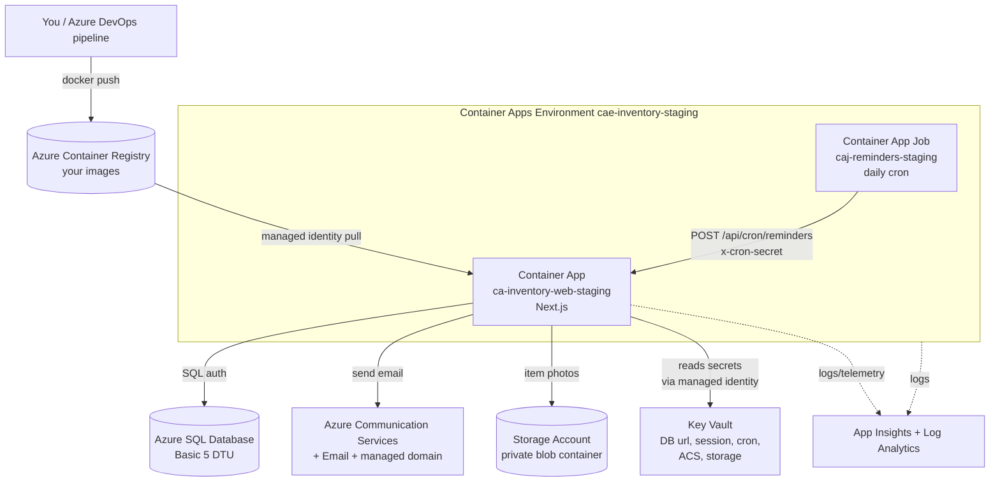

# Azure Staging Setup — `rg-staging`

A beginner-oriented, click-by-click guide to standing up the **production-shaped**
staging infrastructure for this app in the Azure **Portal**, with the concepts
explained as we go.

> You have **Contributor** access to the resource group **`rg-staging`**. That's
> enough to *create* every resource below. The one exception is reading/writing
> **Key Vault secrets**, which needs an extra role you'll grant yourself — see the
> gotcha in §4.

---

## 0. The big picture (read this first)

We're building this shape:



**What each piece is, in one line:**

| Resource | Role in this app |
|---|---|
| **Log Analytics workspace** | The database that stores all logs/metrics. Everything else points at it. |
| **Application Insights** | App-level monitoring (requests, errors, performance) on top of Log Analytics. |
| **Container Registry (ACR)** | Private store for your Docker images. Your pipeline pushes here; ACA pulls. |
| **Key Vault** | Encrypted store for secrets (DB password, session key, etc.). No secrets in plain config. |
| **Azure SQL Database** | Your Prisma database (SQL Server engine), Basic tier for staging. |
| **Communication Services (+Email)** | Sends notification emails (your `lib/email/acs` code). |
| **Storage Account (Blob)** | Holds item photos in a private container (your `lib/storage` code). |
| **Container Apps Environment** | The secure boundary that hosts the web app + the cron job together. |
| **Container App** | Your running Next.js app (with ingress, scaling, revisions). |
| **Container App Job** | The daily reminder cron — pings the app's secure endpoint. |
| **Managed identity** | A passwordless Azure identity for the app, so it can pull images & read secrets without stored credentials. |

**Create them in this order** (each step depends on earlier ones):

1. Log Analytics workspace
2. Application Insights
3. Container Registry
4. Key Vault
5. Azure SQL Database
6. Communication Services + Email
7. Container Apps Environment + Container App (web)
8. Managed identity + secret wiring
9. Container App Job (cron)

> **Storage Account** slots in between 6 and 7 — see **§6B**. It is lettered
> rather than numbered 7 so the existing section numbers, which
> [auth-and-email.md](auth-and-email.md) and
> [azure-devops-setup.md](azure-devops-setup.md) link to, stay put.

---

## Conventions used below

- **"Create a resource"** = the big **+** at the top-left of the Portal, or just type the
  service name into the **top search bar** and pick it, then hit **Create**.
- Every create wizard starts with a **Basics** tab where you pick:
  **Subscription** (the client's), **Resource group = `rg-staging`**, and a **Region**.
- **Pick ONE region and use it for everything** (e.g. the region closest to your users).
  Keeping resources co-located avoids latency and cross-region data charges.
- Resource **names**: some must be *globally* unique (ACR, Key Vault, SQL server, ACS).
  I suggest names below; append a few random characters where "globally unique" is noted.
- After each create, click **Review + create → Create**, then **Go to resource**.

Suggested names (Azure's naming-convention style):

| Resource | Suggested name | Globally unique? |
|---|---|---|
| Log Analytics | `log-inventory-staging` | no |
| App Insights | `appi-inventory-staging` | no |
| Container Registry | `acrinventorystaging` (no dashes allowed) | **yes** |
| Key Vault | `kv-inv-stg-xxxx` | **yes** |
| SQL server (logical) | `sql-inventory-staging-xxxx` | **yes** |
| SQL database | `sqldb-inventory-staging` | no |
| Communication Services | `acs-inventory-staging` | **yes-ish** |
| Storage Account | `stinventorystaging` (lowercase letters + digits only) | **yes** |
| Email Comm. Service | `acsemail-inventory-staging` | no |
| Container Apps Env | `cae-inventory-staging` | no |
| Container App (web) | `ca-inventory-web-staging` | no |
| Container App Job | `caj-reminders-staging` | no |

---

## 1. Log Analytics workspace

**Concept.** This is the central *log/metrics database*. Azure Monitor, Application
Insights, and Container Apps all *send* their data into a Log Analytics workspace,
and you *query* it with KQL (Kusto Query Language). You create it first because two
later resources (App Insights, the Container Apps Environment) need to point at it.

**Steps.**
1. Search **"Log Analytics workspaces"** → **Create**.
2. **Basics**: Resource group `rg-staging`; Name `log-inventory-staging`; Region.
3. **Review + create → Create**.

Nothing else to configure. Pricing is pay-per-GB-ingested; at staging volume this is
a few dollars/month or less.

---

## 2. Application Insights

**Concept.** Application Insights is *APM* (application performance monitoring): it
records incoming requests, failures, dependencies (like your SQL calls), and live
metrics. "Workspace-based" means it stores that data **in the Log Analytics workspace**
from §1 (the modern, recommended mode). Wiring the SDK into the app is optional and
can come later — creating the resource now gives you the connection string to use when
you're ready.

**Steps.**
1. Search **"Application Insights"** → **Create**.
2. **Basics**: RG `rg-staging`; Name `appi-inventory-staging`; Region;
   **Resource Mode = Workspace-based**; **Log Analytics Workspace =** `log-inventory-staging`.
3. **Review + create → Create → Go to resource**.
4. On the **Overview**, copy the **Connection String** and keep it for later
   (env var `APPLICATIONINSIGHTS_CONNECTION_STRING` if/when you add the SDK).

---

## 3. Azure Container Registry (ACR)

**Concept.** A private Docker registry — the "Docker Hub" for your images, but locked
to the client's Azure. Your Azure DevOps pipeline will build the image and
`docker push` it here (e.g. `acrinventorystaging.azurecr.io/inventory-web:latest`); the
Container App will **pull** from here to run. We keep the **admin user disabled** and
instead let the app authenticate with its **managed identity** (§8) — more secure than a
shared username/password.

**Steps.**
1. Search **"Container registries"** → **Create**.
2. **Basics**: RG `rg-staging`; **Registry name** `acrinventorystaging`
   (globally unique, letters/numbers only — **no dashes**); Region; **SKU = Basic**.
3. **Review + create → Create → Go to resource**.
4. On **Overview**, note the **Login server**: `acrinventorystaging.azurecr.io`.
   You'll use this in the pipeline and when pointing the app at its image.

> The registry is empty for now — that's fine. In §7 we start the app on a temporary
> public "hello world" image, then switch it to your ACR image once the pipeline pushes one.

---

## 4. Key Vault

**Concept.** A managed, encrypted secret store. Instead of pasting your DB password or
ACS key into plaintext config, you store them here and let the app read them at runtime
via its managed identity. Two access "planes" matter:
- **Management plane** (create/configure the vault) — your **Contributor** role covers this.
- **Data plane** (read/write the actual secret values) — under RBAC mode this needs a
  **separate role**. **This is the #1 beginner gotcha**, handled in step 5 below.

**Steps.**
1. Search **"Key vaults"** → **Create**.
2. **Basics**: RG `rg-staging`; Name `kv-inv-stg-xxxx` (globally unique, 3–24 chars); Region.
3. **Access configuration** tab: **Permission model = Azure role-based access control (RBAC)**
   (recommended and modern — avoids the older "access policies").
4. **Review + create → Create → Go to resource**.
5. **⚠️ Grant yourself data-plane access** (needed to add secrets):
   - Vault → **Access control (IAM)** → **Add → Add role assignment**.
   - Role: **Key Vault Secrets Officer** → **Next**.
   - Members: **User, group, or service principal** → select **your own account** → **Review + assign**.
   - Wait ~1 minute for it to propagate.

We'll **add the actual secrets in §8**, once the DB and ACS exist and we know their values.

---

## 5. Azure SQL Database (Basic)

**Which tile?** Use **"SQL databases"** (a single, fully-managed database — PaaS).
*Not* "Azure SQL" (that's just a chooser page), *not* "Managed Instance" (a whole
SQL Server, expensive), *not* "reserved vCores" (a billing reservation).

**Concept.** A single Azure SQL database runs on a **logical server**
(`*.database.windows.net`) that you also create here. The server holds the admin login
and the **firewall**; the database holds your tables. Prisma's `sqlserver` provider talks
to it over an encrypted connection string. **Basic tier** = 5 DTU / 2 GB — perfect for
staging (prod moves to S1+ as we discussed).

**Steps.**
1. Search **"SQL databases"** → **Create**.
2. **Basics**:
   - RG `rg-staging`; **Database name** `sqldb-inventory-staging`.
   - **Server** → **Create new**:
     - Server name `sql-inventory-staging-xxxx` (globally unique); Location = your region.
     - **Authentication method** → **Use SQL authentication** (this is what Prisma uses).
     - **Server admin login** e.g. `sqladmin`; set a **strong password** — save both now.
     - **OK**.
   - **Want to use SQL elastic pool?** → **No**.
   - **Workload environment** → **Development** (just sets friendlier defaults).
   - **Compute + storage** → **Configure database**:
     - Change **Service tier** to **Basic (DTU-based)** → this pins 5 DTU / 2 GB → **Apply**.
   - **Backup storage redundancy** → **Locally-redundant** (cheapest; fine for staging).
3. **Networking** tab:
   - **Connectivity method = Public endpoint**.
   - **Allow Azure services and resources to access this server = Yes**
     *(lets the Container App connect — ACA's outbound IPs aren't static, so IP rules alone won't work for staging).*
   - **Add current client IP = Yes** *(so you can connect from your machine to run migrations).*
4. **Review + create → Create → Go to resource**.
5. Note the server FQDN from **Overview**: `sql-inventory-staging-xxxx.database.windows.net`.

**Your Prisma `DATABASE_URL`** (SQL Server format — note the `;`-separated params):

```
sqlserver://sql-inventory-staging-xxxx.database.windows.net:1433;database=sqldb-inventory-staging;user=sqladmin;password=YOUR_PASSWORD;encrypt=true
```

- `encrypt=true` is **required** by Azure SQL.
- **Pooling:** Basic allows only ~30 concurrent workers. Keep Prisma's pool small
  (aim for `replicas × pool ≤ ~20`). Prisma sets pool size on the connection URL — confirm
  the exact parameter for the **SQL Server** connector in Prisma's connection-URL docs, since
  SQL Server uses ADO.NET-style `;` params rather than the usual `?connection_limit=`.
- **Run migrations** once the DB exists (your machine's IP is now allow-listed):
  set `DATABASE_URL` locally and run `npm run db:migrate:deploy`. (Later this becomes a
  pipeline step.)

> **Hardening note (later):** for prod, create a dedicated least-privilege SQL user for the
> app instead of using the server admin, and move to a private endpoint + VNet-integrated ACA.

---

## 6. Azure Communication Services + Email

This is the most multi-part resource: a **Communication Services** parent, an **Email
Communication Service**, a **domain**, and then **connecting** the two. Your app code in
[`lib/email/acs/sender.ts`](../lib/email/acs/sender.ts) already knows how to use it — it
just needs the connection string, a sender address, and `EMAIL_PROVIDER=acs`.

**Concept.** Communication Services (ACS) is a multi-channel comms platform (email, SMS,
chat). For email you must: (a) have an ACS resource, (b) have an Email service with a
**verified sender domain**, and (c) **connect** that domain to the ACS resource so it can
send. For staging we use a free **Azure-managed domain** (instant, no DNS work); it sends
from `DoNotReply@<random>.azurecomm.net` and has modest rate limits — fine for staging.

**Steps.**

**6a. Create the Communication Services resource**
1. Search **"Communication Services"** → **Create**.
2. **Basics**: RG `rg-staging`; **Resource name** `acs-inventory-staging`;
   **Data location** — pick per the client's data-residency needs. **⚠️ This is permanent.**
3. **Review + create → Create**.

**6b. Create the Email Communication Service**
1. Search **"Email Communication Services"** → **Create**.
2. **Basics**: RG `rg-staging`; Name `acsemail-inventory-staging`; **Data location** (match 6a).
3. **Review + create → Create → Go to resource**.

**6c. Provision a managed domain**
1. In the **Email Communication Service** → left menu **Provision domains** (or **Domains**).
2. **Add domain → Azure managed domain → Add**. After a moment you get a domain like
   `xxxxxxxx.azurecomm.net` with a ready sender address.

**6d. Connect the domain to the ACS resource**
1. Go to the **Communication Services** resource (`acs-inventory-staging`) → **Email → Domains**.
2. **Connect domain** → pick the subscription/RG → select your Email service +
   the managed domain → **Connect**.

**6e. Collect the two values your app needs**
1. **Sender address** (`ACS_SENDER_ADDRESS`): in the managed domain → **MailFrom addresses** →
   copy the default, e.g. `DoNotReply@xxxxxxxx.azurecomm.net`.
2. **Connection string** (`ACS_CONNECTION_STRING`): Communication Services resource → **Keys** →
   copy the **primary connection string** (looks like `endpoint=https://...;accesskey=...`).
   → we'll put this in **Key Vault** in §8.

**6f. Activate in the app**
- Env vars: `EMAIL_PROVIDER=acs`, `ACS_CONNECTION_STRING`, `ACS_SENDER_ADDRESS` (set in §8).
  The SDK is already a dependency and is lazy-imported, so nothing is loaded while
  `EMAIL_PROVIDER=local`.

> **⚠️ Rate limits are the thing to plan around here.** The managed domain allows only a
> handful of sends per minute, which the morning reminder run will exceed on its own. The app
> handles that — messages queue and drain at a configured rate rather than being rejected —
> but you must set `EMAIL_RATE_PER_MINUTE` / `EMAIL_RATE_PER_HOUR` to what your sender domain
> actually allows, and you should start the **custom domain** verification early: it is ~6x
> the headroom and, more importantly, `*.azurecomm.net` mail is routinely spam-foldered.
> Read [email-delivery.md](email-delivery.md) before go-live.

---

## 6B. Storage Account (item photos)

*Lettered `6B` rather than numbered `7` so the section numbers that other docs
link to do not shift. It belongs here in reading order: create it before the
Container App, because §8 wires its connection string into the app's config.*

**Concept.** A **Storage Account** is Azure's general-purpose storage resource. We
use one service inside it — **Blob storage** — which holds arbitrary files
("blobs") grouped into **containers**. One container, `item-images`, holds the
photos admins attach to items on `/admin/items`; the code is in
[`lib/storage/`](../lib/storage/) and the database stores only a *key* such as
`items/AP-BX-00001/9f3c….webp`, never the bytes and never a URL.

**Why not the database or the container's own disk.** Images in Azure SQL bloat
every backup and put image reads on the most expensive tier in this deployment.
The Container App's filesystem is worse: it is rebuilt on every revision and is
not shared between replicas, so photos uploaded before a deploy would simply
disappear afterwards, and two replicas would disagree about which exist.

**The container is PRIVATE.** Photos reach the browser through the app's own
`/items/<id>/image` route, which applies the same session check as every page
(growers and vendors can see item photos, so it is gated on being signed in
rather than on an admin capability). There is no public blob URL and no SAS
token in circulation, which is why the anonymous-access switch below stays off.

**Steps.**

**6B-a. Create the Storage Account**
1. Search **"Storage accounts"** → **Create**.
2. **Basics**: RG `rg-staging`; **Storage account name** `stinventorystaging`
   — **globally unique, 3–24 characters, lowercase letters and digits only**
   (no dashes, unlike every other resource here); **Region** (same as everything
   else); **Primary service** = *Azure Blob Storage or Azure Data Lake Storage Gen2*;
   **Performance** = **Standard**; **Redundancy** = **LRS** (cheapest; staging
   photos are reproducible from the client's originals).
3. **Advanced** tab → leave **"Allow enabling anonymous access on individual
   containers"** **UNCHECKED**. This is the account-level switch: with it off,
   nobody can later flip the container to public by accident, which is the single
   most common way private image stores stop being private.
4. **Review + create → Create → Go to resource**.

**6B-b. Create the container**
The app calls `createIfNotExists` on first upload, so this step is optional — but
doing it yourself lets you *see* the access level rather than trusting it.
1. Storage account → **Data storage → Containers → + Container**.
2. **Name** `item-images` (must match `AZURE_STORAGE_CONTAINER`).
3. **Anonymous access level** = **Private (no anonymous access)**.
4. **Create**.

**6B-c. Collect the connection string**
1. Storage account → **Security + networking → Access keys** → **Show** on
   **key1** → copy the **Connection string**
   (`DefaultEndpointsProtocol=https;AccountName=…;AccountKey=…`).
2. → we'll put this in **Key Vault** in §8d as `storage-connection-string`.

**6B-d. Activate in the app**
Two env vars, both set in §8f:

| Env var | Source |
|---|---|
| `AZURE_STORAGE_CONNECTION_STRING` | **Reference a secret** → `storage-connection-string` |
| `AZURE_STORAGE_CONTAINER` | **Manual entry** → `item-images` |

> **⚠️ The pipeline owns env vars, not the Portal.** `azure-pipelines.yml` runs
> `az containerapp update --set-env-vars` on every deploy and its own comment says
> to *"treat this list as the source of truth and stop editing env vars in the
> Portal."* `--set-env-vars` merges, so a Portal-only value survives — until
> someone assumes the pipeline lists everything. Add both lines to the
> `--set-env-vars` block in **both** the staging and production deploy stages:
>
> ```yaml
>   AZURE_STORAGE_CONNECTION_STRING=secretref:storage-connection-string \
>   AZURE_STORAGE_CONTAINER="item-images" \
> ```

> **⚠️ No connection string in production = uploads fail, loudly.**
> [`lib/storage/index.ts`](../lib/storage/index.ts) throws rather than falling back
> to local disk when `NODE_ENV=production`. That is deliberate and matches how
> `MAGIC_LINK_SECRET` and `CRON_SECRET` behave: the fallback would appear to work
> right up until the next revision discarded every photo. Locally, with the
> variable unset, photos go to `.uploads/` and no Azure account is needed at all.

**Cost and growth.** Photos are downscaled in the browser to ~200–400 KB before
upload, so a few thousand items sit comfortably under 1 GB — pennies per month on
Standard LRS. The container does not grow unboundedly: replacing a photo deletes
the one it replaced, and deleting an item deletes its photo. Orphans are only
possible if a save crashes between the upload and the commit, and the app logs
those. No lifecycle-management rule is needed at this volume.

---

## 7. Container Apps Environment + Container App (web)

**Concept — Environment.** A **Container Apps Environment** is the secure boundary (its
own virtual network + a Log Analytics hookup) in which one or more container apps and jobs
run. Apps in the same environment can talk to each other and share the same logs
destination. You create it once; both the web app (§7) and the cron job (§9) live in it.

**Concept — Container App.** Your actual running service. Key sub-concepts:
- **Ingress** — the public HTTPS front door; you set the **target port** to whatever your
  container listens on.
- **Revisions** — every config/image change creates a new immutable revision; you can split
  traffic between them (this is your built-in blue/green, replacing App Service "slots").
- **Scaling** — **min/max replicas** plus **scale rules** (e.g. HTTP concurrency).

**Steps.**
1. Search **"Container Apps"** → **Create**.
2. **Basics**:
   - RG `rg-staging`; **Container app name** `ca-inventory-web-staging`; Region.
   - **Container Apps Environment → Create new**:
     - Name `cae-inventory-staging`.
     - **Monitoring** tab (inside the env dialog) → **Log Analytics =** `log-inventory-staging`.
     - **Create**.
3. **Container** tab:
   - ✅ **Use quickstart image** — this starts the app on a public placeholder
     (`mcr.microsoft.com/k8se/quickstart`) so you can finish wiring before your real image
     exists. We swap it for your ACR image after the pipeline's first push.
4. **Ingress** tab:
   - **Ingress = Enabled**; **Ingress traffic = Accepting traffic from anywhere** (external).
   - **Target port = 80** *(the quickstart image listens on 80). **Remember:** when you switch
     to your Next.js image, change this to **3000** — Next.js standalone listens on `PORT`,
     default 3000.)*
5. **Review + create → Create → Go to resource**.
6. On **Overview**, copy the **Application Url**:
   `https://ca-inventory-web-staging.<region>.azurecontainerapps.io`. Save it — the cron
   job (§9) and, if you use Entra SSO, the redirect URI need it.
7. **Set scaling** (app → **Application → Scale (and replicas)** or **Scale**):
   - **Min replicas = 1** (avoids a cold start on the first morning request).
   - **Max replicas = 3** (headroom for the morning submission burst).
   - **Add scale rule → HTTP → Concurrent requests = 50**.

> **Switching to your real image later:** app → **Containers → Edit and deploy** → select the
> container → **Image source = Azure Container Registry** → pick `acrinventorystaging`, your
> image + tag → **Authentication = Managed identity** (set up in §8) → also set **Target port
> = 3000** under Ingress. **Save** creates a new revision.

---

## 8. Managed identity + secret wiring (the heart of "production-shaped")

**Concept — Managed identity.** Rather than storing an ACR password or a Key Vault key
*inside* the app, Azure gives the Container App its **own identity** in Entra ID
(a "system-assigned managed identity"). You then grant that identity **roles** on other
resources (pull from ACR, read Key Vault secrets). The platform handles the credentials
invisibly — nothing secret lives in your config. This is the passwordless, best-practice way.

**8a. Turn on the app's managed identity**
1. App → **Settings → Identity → System assigned** → **Status = On → Save → Yes**.
2. Note the **Object (principal) ID** that appears.

**8b. Let it pull images from ACR**
1. Go to **ACR** (`acrinventorystaging`) → **Access control (IAM) → Add role assignment**.
2. Role **AcrPull** → **Next** → Members: **Managed identity** → select
   `ca-inventory-web-staging` → **Review + assign**.

**8c. Let it read Key Vault secrets**
1. Go to **Key Vault** → **Access control (IAM) → Add role assignment**.
2. Role **Key Vault Secrets User** → Members: **Managed identity** →
   `ca-inventory-web-staging` → **Review + assign**.

**8d. Put the secrets into Key Vault**
(You granted yourself **Secrets Officer** back in §4-5, so you can add these now.)
Vault → **Objects → Secrets → + Generate/Import**, create each:

| Secret name | Value |
|---|---|
| `database-url` | the full Prisma `DATABASE_URL` from §5 |
| `session-secret` | a long random string — generate with `openssl rand -base64 32` (or PowerShell: `[Convert]::ToBase64String((1..32|%{Get-Random -Max 256}))`) |
| `acs-connection-string` | the ACS connection string from §6e |
| `storage-connection-string` | the Storage Account connection string from §6B-c |
| `token-cache-secret` | a long random string, **distinct from the two above** — encrypts stored Microsoft refresh tokens (§10d) |
| `cron-secret` | another long random string (the Job in §9 reuses this) |
| `azure-ad-client-secret` | Entra app client secret (§10a) — add when you enable internal SSO |
| `magic-link-secret` | a long random string, **distinct from `session-secret`** — signs external magic-links (§10c) |

**8e. Reference those secrets from the Container App**
1. App → **Settings → Secrets → Add**.
2. For each: **Type = Key Vault reference** → pick the vault + secret (latest
   version) → **Identity = System assigned** → **Add**. This creates app-level secrets named
   e.g. `database-url` that always fetch from Key Vault.

**8f. Map env vars to those secrets (and set the plain ones)**
App → **Containers → Edit and deploy** → select the container → **Environment variables** →
add:

| Env var | Source |
|---|---|
| `DATABASE_URL` | **Reference a secret** → `database-url` |
| `SESSION_SECRET` | **Reference a secret** → `session-secret` |
| `ACS_CONNECTION_STRING` | **Reference a secret** → `acs-connection-string` |
| `AZURE_STORAGE_CONNECTION_STRING` | **Reference a secret** → `storage-connection-string` *(item photos, §6B)* |
| `CRON_SECRET` | **Reference a secret** → `cron-secret` |
| `MAGIC_LINK_SECRET` | **Reference a secret** → `magic-link-secret` *(external magic-link, §10c)* |
| `TOKEN_CACHE_SECRET` | **Reference a secret** → `token-cache-secret` *(Power BI embedding, §10d)* |
| `APP_URL` | **Manual entry** → `https://ca-inventory-web-staging.<region>.azurecontainerapps.io` *(§10c)* |
| `ACS_SENDER_ADDRESS` | **Manual entry** → `DoNotReply@xxxxxxxx.azurecomm.net` |
| `AZURE_STORAGE_CONTAINER` | **Manual entry** → `item-images` |
| `EMAIL_PROVIDER` | **Manual entry** → `acs` |
| `NODE_ENV` | **Manual entry** → `production` |
| `APPLICATIONINSIGHTS_CONNECTION_STRING` | **Manual entry** → from §2 (optional, if you add the SDK) |

*Also set, once the Entra app registration exists (§10a):* `AZURE_AD_CLIENT_ID`,
`AZURE_AD_TENANT_ID`, `AZURE_AD_CLIENT_SECRET` *(as a Key Vault secret),*
`AZURE_AD_REDIRECT_URI` *= `https://<app-url>/api/auth/callback`. Until they are set,
"Sign in with Microsoft" reports that it isn't configured and the magic-link box still works.*

*And the email throughput settings — `EMAIL_RATE_PER_MINUTE`, `EMAIL_RATE_PER_HOUR`,
`EMAIL_INTERACTIVE_RESERVE` — which must match what your sender domain actually allows.
See [email-delivery.md](email-delivery.md).*

Click **Save** — this deploys a **new revision** with all the config.

---

## 9. Container App Jobs (reminder cron + email safety net)

**Concept.** A **Container App Job** is a *run-to-completion* workload (not an always-on
service) that the environment starts on a **schedule**, and you're billed only for the
seconds it runs. Both of the jobs below just make one authenticated `curl` to a
secret-protected endpoint on your app, so neither needs your app's image or the database.

**There are two of them:**

| Job | Cron | Endpoint | What it does |
|---|---|---|---|
| `caj-reminders-staging` | `0 8 * * *` | `POST /api/cron/reminders` | queues one reminder per overdue grower |
| `caj-email-dispatch-staging` | `*/15 * * * *` | `POST /api/cron/email-dispatch` | **safety net** for the email queue |

The reminder job only *queues* — the app sends separately, paced to the mail provider's
rate limits (see [email-delivery.md](email-delivery.md)) — so it returns in milliseconds
however many growers are overdue, and the replica timeout is never in play.

The dispatch job is a backstop. The running app already drains its email queue every 30
seconds by itself; this job exists so a restarted or scaled-to-zero app can't leave mail
sitting. **Fifteen minutes, not one:** an every-minute job is ~1,440 container starts a day
for work that takes seconds, which would eat most of the free vCPU-second grant that the web
app also draws on. If you'd rather have no in-app timer at all, set
`EMAIL_DISPATCH_INTERVAL_MS=0` and run this job every minute instead.

**Steps** (repeat for both jobs, changing the name, cron and URL):
1. Search **"Container App Jobs"** → **Create** (or Container Apps → **Jobs → Create**).
2. **Basics**:
   - RG `rg-staging`; **Job name** as above; Region;
   - **Container Apps Environment =** `cae-inventory-staging` (the same one).
   - **Trigger type = Schedule**; **Cron expression** as above (times are UTC).
     Parallelism 1, replica completion count 1.
3. **Container** tab:
   - **Image source = Docker Hub or other registries**; **Image =** `curlimages/curl:latest`
     (a tiny public image with `curl`).
   - **Command override** — set:
     - Command: `/bin/sh`
     - Args: `-c, curl -fsS -X POST -H "x-cron-secret: $CRON_SECRET" https://ca-inventory-web-staging.<region>.azurecontainerapps.io/api/cron/reminders`
       *(use your real Application Url from §7-6; `-f` makes a non-2xx fail the run
       instead of exiting 0 with an error page in the log)*.
4. **Review + create → Create → Go to resource**.
5. **Give the job the `CRON_SECRET`** (same value as the app):
   - Job → **Settings → Identity → System assigned → On → Save**.
   - Key Vault → **IAM** → assign **Key Vault Secrets User** to the **job's** identity (as in §8c).
   - Job → **Settings → Secrets** → add `cron-secret` as a **Key Vault reference**.
   - Job → **Containers/Environment variables** → `CRON_SECRET` → **Reference a secret** → `cron-secret`.
6. **Test it now**: Job → **Run now** → check **Execution history** → the run should exit 0,
   and your app's Outbox / `NotificationLog` should reflect it.

> **Why not run `npm run reminders` in the job?** You could, but your production Docker image
> uses Next.js *standalone* output, which won't include `tsx`/`scripts`. The
> `curl`-the-endpoint approach avoids that entirely.

**Or create them via CLI** (reproducible equivalent; wire identity + secret as in step 5):
```bash
KV=https://kv-inv-stg-xxxx.vault.azure.net/secrets
APP=https://ca-inventory-web-staging.<region>.azurecontainerapps.io

for spec in "caj-reminders-staging|0 8 * * *|reminders" \
            "caj-email-dispatch-staging|*/15 * * * *|email-dispatch"; do
  IFS='|' read -r NAME CRON PATHNAME <<< "$spec"

  az containerapp job create \
    --name "$NAME" \
    --resource-group rg-staging \
    --environment cae-inventory-staging \
    --trigger-type Schedule \
    --cron-expression "$CRON" \
    --replica-timeout 300 --replica-retry-limit 1 \
    --image curlimages/curl:latest --cpu 0.25 --memory 0.5Gi \
    --command "/bin/sh" \
    --args "-c" "curl -fsS -X POST -H \"x-cron-secret: \$CRON_SECRET\" $APP/api/cron/$PATHNAME"

  az containerapp job identity assign --name "$NAME" -g rg-staging --system-assigned
  az containerapp job secret set --name "$NAME" -g rg-staging \
    --secrets cron-secret=keyvaultref:$KV/cron-secret,identityref:system
done
```
Then grant each job's identity **Key Vault Secrets User** on the vault, and map the env var
`CRON_SECRET` → `secretref:cron-secret` on each job's container.

---

## 10. Identity & access — how users sign in

Two populations sign in two different ways. The app's session layer
([`lib/auth/session.ts`](../lib/auth/session.ts)) is **auth-provider-agnostic** — every
path just ends by calling `createSession(user.id)` — so the two methods coexist, and
**authorization is always driven by the `User` row's role + grower/vendor mapping, not by
*how* the user logged in**.

| Population | Roles | How they sign in |
|---|---|---|
| Internal client staff | `SuperAdmin`, `InternalAdmin`, `Editor` | **Microsoft login (Entra ID)** |
| Growers & vendors | `GrowerUser`, `VendorUser` | **App-managed email** (passwordless link) |

### 10a. Internal users — Microsoft login (Entra ID)

**Concept.** The app is an OIDC *relying party* against the **client's own Entra tenant**.
On callback it matches the Entra **object id (`oid`)** — falling back to the admin-provisioned
email the first time — to a `User` row (reference code in
[`lib/auth/entra.ts`](../lib/auth/entra.ts)), **backfills
`User.entraObjectId`** so a later email change can't lock the person out, and if active issues
the normal session. "Reject if unprovisioned" is the built-in access gate.

> **⚠️ This is NOT done from `rg-staging`.** An **app registration** lives in the client's
> **Entra directory**, which your resource-group **Contributor** role does *not* let you
> touch. The client's IT must create it, or grant you **Application Administrator**. Plan
> for this hand-off — it's the most common surprise.

Steps (in the **client's Entra tenant**, by you or their admin):
1. **Entra ID → App registrations → New registration.**
   - **Supported account types = Accounts in this organizational directory only**
     (**single-tenant**) — this alone blocks any non-client account.
   - **Redirect URI (Web)** = `https://ca-inventory-web-staging.<region>.azurecontainerapps.io/api/auth/callback`.
2. Note the **Application (client) ID** and **Directory (tenant) ID**.
3. **Certificates & secrets → New client secret** → copy the value **once** → store in
   **Key Vault** as `azure-ad-client-secret` (§8 pattern), never in plain config.
   *(Secrets expire in 6–24 months — set a rotation reminder, or later switch to a
   federated credential to drop the secret entirely.)*
4. **API permissions → Microsoft Graph → `User.Read`** (delegated) → **Grant admin consent**.
5. **Limit who can sign in** (defence-in-depth on top of the app's provisioning gate):
   - **Enterprise applications → <your app> → Properties → Assignment required = Yes.**
   - **Users and groups → Add →** assign a security group (e.g. `InventoryApp-Users`);
     unassigned staff are stopped at Microsoft's login. *(Assigning a **group** needs
     **Entra ID P1**; individual-user assignment is free.)*

**App wire-up:** `npm i @azure/msal-node`; create the 3 route handlers from the reference
file; set env vars `AZURE_AD_TENANT_ID`, `AZURE_AD_CLIENT_ID`,
`AZURE_AD_CLIENT_SECRET` (Key Vault reference), `AZURE_AD_REDIRECT_URI`.

**Three layers of access control**, weakest to strongest:
1. **Single-tenant registration** → only client-directory accounts can attempt sign-in.
2. **App provisioning gate (already built)** → session only issued if an active `User` row
   matches the email. Admins in the users page are the source of truth. Works on any Entra tier.
3. **Assignment required + group** (optional, needs P1) → unassigned staff blocked at Entra.

### 10b. External users — app-managed email (recommended: passwordless)

**Do NOT make growers/vendors Entra B2B guests** — that puts 50–100 external accounts in
the client's *corporate* directory (governance/pollution) and needs Graph provisioning, for
no authorization benefit (the app already gates via the `User` table).

Two viable routes:

- **Recommended — passwordless magic-link, app-managed.** Reuses what you already have
  (`jose` signed tokens + ACS delivery). Two endpoints: *request a link* (email a
  short-lived signed token) and *consume it* (verify → `createSession`). No passwords ⇒ no
  forgot/reset/lockout/policy to build. `passwordHash` can stay `null`. This is **app
  development work, not Azure infra.**
- **Alternative — Entra External ID (managed CIAM).** If you'd rather own *zero* auth flows:
  Microsoft hosts sign-up/in, reset, MFA; your app does one OIDC callback (like 10a).
  External users live in a **separate external tenant** — *not* the corporate directory — so
  none of the guest governance problems. Free at this scale (~first 50k monthly active
  users). Cost: another Azure product + tenant to configure, and a second IdP to run.

> **This is a hybrid, not a switch.** Both login routes are live at once and `/login` offers
> "Sign in with Microsoft" *and* the email option. They partition naturally: growers and
> vendors have no client-tenant account, and internal staff are refused magic links.
> `AUTH_PROVIDER` does not choose between them — it only controls the development-only demo
> picker. See [auth-and-email.md](auth-and-email.md).

**Identity checklist**
- [ ] App registration in the **client's** Entra tenant (single-tenant); redirect URI set
- [ ] Client secret stored in Key Vault as `azure-ad-client-secret`
- [ ] `User.Read` admin-consented
- [ ] Post-logout redirect URI `https://<app-url>/login` registered (sign-out ends the tenant SSO session)
- [ ] (optional) Assignment required + `InventoryApp-Users` group (needs P1)
- [ ] `AZURE_AD_*` env vars set on the Container App
- [ ] `magic-link-secret` in Key Vault; `MAGIC_LINK_SECRET` + `APP_URL` env vars set

### 10c. Magic-link setup (external users) — infra side

The app side is built — routes, the `MagicToken` table, the sliding session; see
[auth-and-email.md](auth-and-email.md). On **their infra** you only add one secret and two
env vars (ACS is already set up in §6):

1. **Key Vault** → add secret `magic-link-secret` = a long random string **distinct from
   `session-secret`** (§8d).
2. **Container App → Secrets** → add a Key Vault reference to it (§8e), then set **env vars** (§8f):
   - `MAGIC_LINK_SECRET` → reference `magic-link-secret`
   - `APP_URL` → `https://ca-inventory-web-staging.<region>.azurecontainerapps.io` (used to build the link)
3. Confirm `EMAIL_PROVIDER=acs`, `ACS_CONNECTION_STRING`, `ACS_SENDER_ADDRESS` are set (§6/§8) —
   the magic-link email uses the same ACS sender.
4. The `MagicToken` table ships as a Prisma migration and is applied by the pipeline's
   `prisma migrate deploy` step (§13) — no manual DB work.

Links expire in **15 min** and are single-use; the **7-day session** they create rolls forward
on activity (the sliding session runs in `proxy.ts`). Only a hash of each link is stored, so
this table is not worth stealing.

---

### 10d. Power BI embedding — permissions and consent

`/admin/reports/power-bi` renders reports with **"embed for your organization"**
(user-owns-data): the app acquires a Power BI token **for the signed-in admin**
and hands it to the embed, so each viewer sees exactly the reports their own
Power BI permissions allow.

**Why not simply put the report URL in an iframe.** A secure-embed URL in a frame
authenticates itself using Microsoft cookies **in a cross-site context**, and
browsers are removing that: Safari blocks third-party cookies outright, Firefox
partitions them, Chrome and Edge restrict them and enterprise policy usually
tightens it further. The symptom is a blank panel or a sign-in prompt inside the
frame, for someone who signed into this app with Microsoft moments earlier.
Passing a token we obtained ourselves sidesteps the whole problem, because the
frame is no longer responsible for authenticating anybody.

**Cost.** None beyond the licences. This is the same licensing as viewing the
report in Power BI: every viewer needs **Power BI Pro** (or the workspace on F64+
capacity, which is not worth it for a handful of admins). It needs **no capacity
SKU** — that is only required for *embed for your customers*, where viewers hold
no licence at all. Reports are restricted to SuperAdmin and InternalAdmin, so the
licence count is small and matches the people who already sign in through Entra.

> **⚠️ Two different administrators, two different portals.** Steps 1–2 below are
> done by an **Entra** administrator, step 3 by a **Power BI** administrator.
> They are often not the same person, and step 3 is invisible from Entra — an app
> with perfect permissions still renders nothing while that tenant setting is off.
> Raise both early; like the app registration itself (§10a), this is a dependency
> on somebody else's calendar rather than something you can unblock yourself.

**10d-1. Add the Power BI permission to the app registration**

In the **client's Entra tenant**, on the registration created in §10a:

1. **Entra ID → App registrations →** select the app (match the Application ID in
   `AZURE_AD_CLIENT_ID`).
2. **API permissions → Add a permission**.
3. Pick **Power BI Service** — usually under *APIs my organization uses* rather
   than the Microsoft APIs tab.
4. Choose **Delegated permissions**, **not** Application permissions. Delegated
   means the app acts *on behalf of the signed-in user* and can never exceed what
   that person could do themselves, which is the entire point: an admin with no
   access to a report gets nothing here either. Application permissions would
   give the app its own tenant-wide reach, which is the service-principal model
   we are deliberately not using.
5. Tick **`Report.Read.All`** and **`Dataset.Read.All`**. The second is needed
   because a report reads its semantic model; embedding fails without it.
6. Confirm **`offline_access`** is present under **Microsoft Graph**. It is what
   yields a refresh token, and without one the app can mint a Power BI token at
   login and never again — reports would break an hour into every session.
7. **Add permissions.**

**10d-2. Grant admin consent**

Power BI Service permissions are tenant-scoped, so an administrator must consent
**once, for everyone**. Users cannot consent for themselves. Without it, every
admin hits `AADSTS65001` / *"Need admin approval"* and simply cannot proceed.

1. **API permissions → Grant admin consent for \<tenant\>**.
2. Check every row reads green **"Granted for \<tenant\>"**. Amber or blank means
   it did not take.

If that button is greyed out you do not hold the role — it needs **Global
Administrator**, **Privileged Role Administrator** or **Cloud Application
Administrator**. Rather than trading screenshots, send the tenant admin this link:

```
https://login.microsoftonline.com/<tenantId>/adminconsent?client_id=<clientId>
```

They sign in, see exactly what is requested, and approve in one click.

**10d-3. Enable embedding in the Power BI tenant (a separate switch)**

This is **not** in Entra and is owned by the Power BI administrator.

1. **Power BI → Settings → Admin portal → Tenant settings → Developer settings**.
2. Enable **"Embed content in apps"**, for the whole organisation or for a
   security group containing the admins who will view reports.
3. Give it a few minutes to propagate.

**10d-4. Workspace access and licences**

1. Each viewing admin needs a **Power BI Pro** licence.
2. Each needs at least **Viewer** on the workspace holding the report. The app
   grants nothing on its own — it only presents what that person already has.
3. The email on their `User` row must be the **same identity** as their Power BI
   account, which it already is: §10a matches Entra sign-in to that row.

**10d-5. App wire-up**

One secret and one env var (§8d–8f):

| Setting | Value |
|---|---|
| Key Vault secret `token-cache-secret` | a long random string, **distinct from `session-secret` and `magic-link-secret`** |
| Env `TOKEN_CACHE_SECRET` | Key Vault reference to the above |

Add it to the `--set-env-vars` block in **both** deploy stages of
`azure-pipelines.yml`, not only the Portal (§6B-d explains why):

```yaml
  TOKEN_CACHE_SECRET=secretref:token-cache-secret \
```

**What that secret protects.** Obtaining a Power BI token later in a session needs
a **refresh token**, which must therefore be stored. It is encrypted with this key
before it goes anywhere near the database, so a database backup on its own does
not yield usable Microsoft credentials. It is separate from `session-secret` for
the same reason `magic-link-secret` is: a key that decrypts refresh tokens and a
key that signs session cookies should never be interchangeable.

**With it unset**, no token is stored, the reports page says so plainly, and the
rest of the application is unaffected. Nothing else depends on it.

Finally, store each report's **secure embed URL** in `PowerBiReport.embedUrl`:

1. In Power BI, open the report → **File → Embed report → Website or portal**.
2. Copy the URL it gives you. It looks like
   `https://app.powerbi.com/reportEmbed?reportId=…&groupId=…`.
3. **Do not copy the address bar instead.** That gives a `/groups/…/reports/…`
   URL, which is not an embed URL and will not render.

---

## 11. Final checklist

- [ ] Log Analytics workspace created
- [ ] App Insights (workspace-based) created; connection string saved
- [ ] ACR created; login server noted; admin user left **disabled**
- [ ] Key Vault created (**RBAC** mode); you have **Secrets Officer** on it
- [ ] SQL DB (Basic) created; firewall allows **Azure services** + **your IP**; `DATABASE_URL` built
- [ ] `prisma migrate deploy` run against the new DB
- [ ] ACS + Email + managed domain created **and connected**; sender + connection string saved
- [ ] `@azure/communication-email` installed; `EMAIL_PROVIDER=acs`
- [ ] Storage Account created; anonymous access **disabled at the account level**
- [ ] `item-images` container exists and is **Private**; connection string saved
- [ ] Upload a photo on `/admin/items` → it appears; the blob's direct URL is **not** publicly readable
- [ ] Container Apps Environment created (wired to Log Analytics)
- [ ] Web Container App running (quickstart image → later your ACR image, **port 3000**)
- [ ] App **managed identity** on; granted **AcrPull** + **Key Vault Secrets User**
- [ ] Key Vault secrets created; referenced as app secrets; env vars mapped
      (including `AZURE_STORAGE_CONNECTION_STRING` / `AZURE_STORAGE_CONTAINER`)
- [ ] The storage env vars are in `azure-pipelines.yml`, not only in the Portal
- [ ] Power BI: `Report.Read.All` + `Dataset.Read.All` **delegated**, admin consent
      **granted** (green in API permissions), `offline_access` present (§10d)
- [ ] Power BI admin portal: **"Embed content in apps"** enabled (a separate switch
      from Entra — an app with correct permissions still renders nothing without it)
- [ ] Viewing admins have a **Pro licence** and at least **Viewer** on the workspace
- [ ] `token-cache-secret` in Key Vault and `TOKEN_CACHE_SECRET` in the pipeline
- [ ] `PowerBiReport.embedUrl` holds a **`/reportEmbed?reportId=…`** URL, not an
      address-bar `/groups/…/reports/…` one
- [ ] Scaling: min 1 / max 3, HTTP-concurrency rule
- [ ] Cron **Job** created, has `CRON_SECRET`, **Run now** succeeds

---

## 12. Rough monthly cost (staging)

| Resource | ~Cost |
|---|---|
| Container App (1 warm replica, 0.5 vCPU/1 GiB) | ~$15–30 (less if scaled to zero off-hours) |
| Container App Job | ~$0–1 |
| Azure SQL Basic (5 DTU) | ~$5 |
| ACR Basic | ~$5 |
| Key Vault | ~$0 (per-operation, negligible) |
| Log Analytics + App Insights | ~$5–15 (depends on volume/retention) |
| Communication Services (email) | pay-per-email, pennies at staging volume |
| Storage Account (item photos, Standard LRS) | ~$0 (well under 1 GB; pennies per GB/month) |
| **Total** | **~$35–60/month** |

---

## 13. CI/CD pipeline (build → migrate → deploy)

The `Dockerfile`, `.dockerignore`, and `azure-pipelines.yml` now exist in the repo, and
`next.config.ts` sets `output: "standalone"`.

**Branching model the pipeline implements:**

```
push to dev              -> Validate only (no deploy)
PR dev -> staging (merge) -> Validate -> Build image -> Deploy STAGING
PR staging -> master      -> Validate -> [approval] -> Promote SAME image to PROD
```

**Four stages:**

1. **Validate** — runs on every PR and branch build: `prisma generate` → `typecheck` → `lint` →
   `next build`. This is the gate the promote-by-PR model depends on.
2. **Build** (staging branch only) — `az acr build` tags the image `:sha-<commit>` and moves a
   floating `:staging` tag.
3. **Deploy → staging** — `prisma migrate deploy` → `db:bootstrap` → roll the revision → poll
   `/login` until it returns 200.
4. **Promote → production** (master branch only) — resolves `:staging` to its **sha256 digest** and
   deploys the digest.

### Build once, promote by digest

The master merge commit is a *different commit* from the staging one, so rebuilding on master would
ship an image nobody tested — different dependency resolution, possibly a newer base-image patch.
The production stage therefore never builds. It resolves the `:staging` tag to its immutable digest
and deploys `repo@sha256:…`, which is content-addressed: production provably runs the exact bytes
staging validated. Each promotion is also tagged `:prod-<BuildId>` for traceability.

### ⚠️ Migrations are not rollback-safe — expand/contract

Rolling the container image back does **not** roll the schema back. If a release drops or renames a
column, the previous image will break against the new schema.

This is not hypothetical: migration `20260806090000` drops `UnitConversion` and drops
`Vendor.leadTime`/`paymentTerms`. Rolling back to an image built before it would fail.

So for anything destructive, split it across two releases:

1. **Expand** — add the new column/table, deploy code that writes both old and new, backfill.
2. **Contract** — in a *later* release, once no running image needs the old shape, drop it.

The production approval sits **before** the migrate step for this reason: once migrations apply you
are committed.

**One-time setup in Azure DevOps:** the click-by-click version is a separate
document — [azure-devops-setup.md](azure-devops-setup.md). In summary:
- Create an **ARM service connection**; put its name in `azureSubscription` (top of the YAML).
- Create **variable groups** `inventory-staging-secrets` and (later)
  `inventory-production-secrets`, **linked to Key Vault**, exposing `DATABASE_URL`,
  `BOOTSTRAP_ADMIN_EMAIL`, `BOOTSTRAP_ADMIN_FIRST_NAME`, `BOOTSTRAP_ADMIN_LAST_NAME`.
- Create **Environments** `inventory-staging` and `inventory-production`, and add a **required
  approver** on the production one. Approvals live on the Environment in the ADO UI — they cannot
  be expressed in the YAML.
- Add **branch policies** on `staging` and `master` requiring the Validate stage. The `pr:` trigger
  runs the build but does **not** block a merge on its own; the policy does.
- Ensure the ACA app's **managed identity has AcrPull** (§8b) so it can pull the new image.

**Production is disabled until you flip a flag.** `productionEnabled: false` at the top of the YAML
keeps the master branch to validation only, so merging to master cannot fail on infrastructure that
does not exist yet. Set it to `true` once the production RG, ACA app, Environment and variable group
are in place, and confirm `prodResourceGroup` / `prodAcaApp`.

### ⚠️ Contributor is not enough for the role assignments

Contributor can create resources but **cannot grant access to them** — it lacks
`Microsoft.Authorization/roleAssignments/write`. Two steps in this guide need that:

- granting the ACA managed identity **AcrPull** on the registry (§8b), and
- granting it **Key Vault Secrets User** (§8).

Options, best first:
1. Ask whoever owns the subscription for **User Access Administrator** (or RBAC Administrator) on
   `rg-inventory-staging`, or ask them to make those two assignments for you.
2. Use a Key Vault on the **access-policy** permission model rather than RBAC — setting access
   policies is a control-plane operation on the vault itself, which Contributor *does* have.
3. Last resort for ACR: enable the registry **admin user** and store its credentials as a Container
   App secret. Works with Contributor alone, but it is a shared static credential rather than a
   managed identity — avoid it for production.

Creating the ARM **service connection** may also need elevated rights, since it creates a service
principal and assigns it a role. If the automatic route is blocked, have an admin create the app
registration and use a manually-configured service connection.

**Two gotchas to expect:**
- **Azure SQL firewall vs hosted agents.** The Migrate stage reaches Azure SQL from a
  Microsoft-hosted agent, whose IPs aren't reliably covered by "Allow Azure services." If
  `migrate deploy` can't connect, allow the agent's IP range, use a **self-hosted agent** in-network,
  or run migrate/bootstrap from an Azure-resident context.
- **Build-time `DATABASE_URL`.** If `next build` ever errors asking for a DB (a statically analysed
  route touching Prisma), pass a dummy `DATABASE_URL` build arg — the app is auth-gated/dynamic so
  it usually isn't needed, but keep it in mind.

**Remaining manual step (once, after the first successful build):** in the Container App, switch the
container from the placeholder image to `acrinventorystaging.azurecr.io/inventory-web:latest` with
**Authentication = Managed identity**, and set **Ingress target port = 3000** (§7 note).
